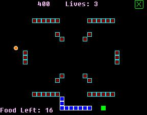



## \[NibbleWorm 2\]

### Description

(updated now 2.0.1! fixed highscore bug, also now the game starts over if you die. added: extra life every 5000 points!) This is NibbleWorm 2. A much better version of the origional. It is a lot like the origional, but now you can play custom levels instead of the endless version, choose your color, link levels (like after level 1 you go to level 2), and MORE. Read the README for more details. This code has some good examples of calling subroutines on other forms, sound, writing to file, reading from file, FormOnTop, and MORE! I don't want to list them all because I can't remember them all because they are so many. Heheheh. Please inform me of any problems/bugs! You can e-mail me your own level packs (put in a .zip file) at iwishiwasfat@yahoo.com and I may put it up on my website (its not a very good website, but it's a website)
 
### More Info
 

             |
---                |---
**Submitted On**   |2004-03-23 19:31:44
**By**             |[Jason Liang](https://github.com/Planet-Source-Code/PSCIndex/blob/master/ByAuthor/jason-liang.md)
**Level**          |Intermediate
**User Rating**    |3.7 (11 globes from 3 users)
**Compatibility**  |VB 3\.0, VB 4\.0 \(16\-bit\), VB 4\.0 \(32\-bit\), VB 5\.0, VB 6\.0
**Category**       |[Games](https://github.com/Planet-Source-Code/PSCIndex/blob/master/ByCategory/games__1-38.md)
**World**          |[Visual Basic](https://github.com/Planet-Source-Code/PSCIndex/blob/master/ByWorld/visual-basic.md)
**Archive File**   |[\[NibbleWor1723683232004\.zip](https://github.com/Planet-Source-Code/jason-liang-nibbleworm-2__1-52196/archive/master.zip)

